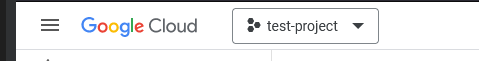
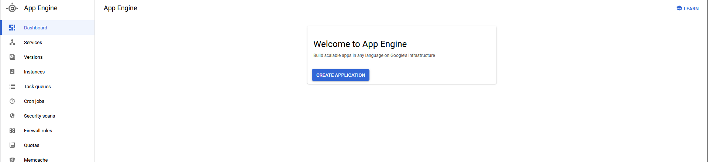
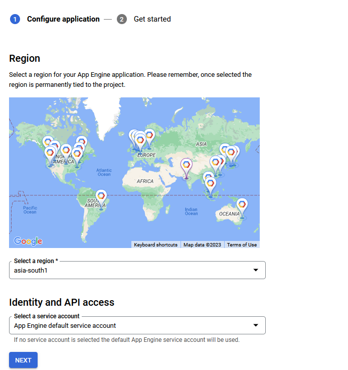
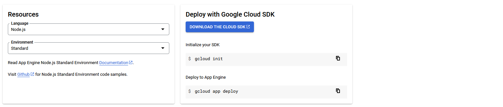
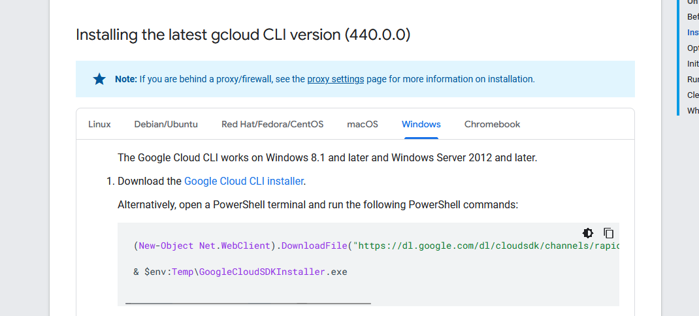

# Googe App Engine
Google app engine by definition is a "Platform as a Service (PaaS)" that allows developers to build and run web applications on Google's infrastructure.

Google app engine is the easiest way you can deploy your backend code written in following languages / frameworks
1. Python
2. Java
3. Node.js
4. Golang
5. Ruby
6. DOT Net
7. PHP

## Creating a new application
Considering you have created a project and you have selected it. Your google console header should have a project selected. Mine here shows "test-project" selected in projects drop-down. Also, you need to set up billing to create an App Engine Application.

Now you can create an App Engine Application. Go to google cloud console. In search bar, type "app engine" and select "App Engine" from drop-down. In case if there are no applications, you will see this board to create a new application.

Further clicking on create button, you can create an application following easy steps according to your requirements. Select the region and select default service account.

On this page, you can select the language and environment. Fou can download the cloud sdk to deploy your application. If you have already downloaded cloud sdk and set it up on your machine, skip this step.

Now, your app engine is ready.

To install cloud sdk you can also follow this link to download cloud sdk: https://cloud.google.com/sdk/docs/install-sdk. Simply click on the link on first instruction in the following screenshot and it will download the installer and then you can install cloud cli.

## Deploying your application through cloud sdk on app engine

In the sample-apps folder, you will find a basic node js application "node-example-api-test". You can use that to test deployment to app engine.

First you need to initialize your gcloud sdk using following command

`gcloud init`

Once initialized, you can simply deploy the application using following command

`gcloud app deploy`

Once deployment is successful, you can visit your app through following command

`gcloud app browse`
## Things that can go wrong

In case if you have error regarding dependencies installation on cloud, try deleting package-lock.json and /node-modules folder from the directory(if exists)

In case if deployment is successful but when you visit the domain, it does not run successfully, you can try checking the default port in index.js file. The default port should be '8080'